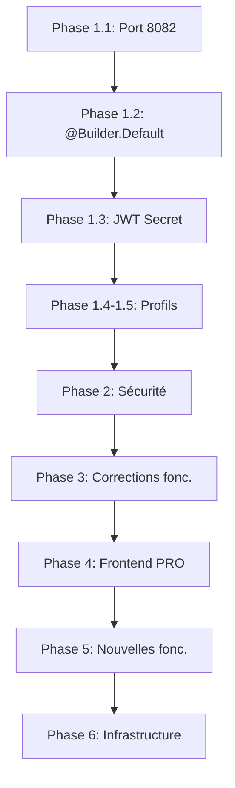

# PLAN DE CORRECTION — Projet GENUC Platform

> **Date :** 01/07/2026  
> **Contexte :** Plateforme de gestion universitaire pour la RDC  
> **Objectif :** Corriger les bugs, sécuriser l'application et améliorer les fonctionnalités

---

## TABLE DES MATIÈRES

1. [PHASE 1 : CORRECTIONS CRITIQUES (IMMÉDIATES)](#phase-1--corrections-critiques-immédiates)
2. [PHASE 2 : SÉCURITÉ](#phase-2--sécurité)
3. [PHASE 3 : CORRECTIONS FONCTIONNELLES](#phase-3--corrections-fonctionnelles)
4. [PHASE 4 : AMÉLIORATIONS FRONTEND](#phase-4--améliorations-frontend)
5. [PHASE 5 : NOUVELLES FONCTIONNALITÉS CONTEXTE RDC](#phase-5--nouvelles-fonctionnalités-contexte-rdc)
6. [PHASE 6 : INFRASTRUCTURE & DÉPLOIEMENT](#phase-6--infrastructure--déploiement)

---

## PHASE 1 : CORRECTIONS CRITIQUES (IMMÉDIATES)

### 1.1 🔴 Port 8082 déjà utilisé

**Fichier(s) :** —  
**Problème :** `Web server failed to start. Port 8082 was already in use.`  
**Action :** Tuer le processus occupant le port 8082

```bash
# Vérifier quel processus utilise le port 8082
netstat -ano | findstr :8082

# Tuer le processus (remplacer PID par l'ID trouvé)
taskkill /PID <PID> /F

# Alternative : changer le port dans application.yml
# server.port: ${SERVER_PORT:8082} → ${SERVER_PORT:8083}
```

### 1.2 🔴 @Builder sans @Builder.Default — 37 fichiers à corriger

**Fichiers concernés :**

- `model/Note.java` — `noteMax = 20.0`, `statut = StatutNote.EN_COURS`, `session = 1`, `nbAbsences = 0`
- `model/Deliberation.java` — `creditsValides = 0`, `decision = DecisionJury.EN_ATTENTE`, `statut = StatutDeliberation.EN_PREPARATION`
- `model/Universite.java` — `fraisBase = 0.0`, `inscriptionsOuvertes = false`, `actif = true`
- `model/Etudiant.java` — manque `@Builder.Default` sur `actif = true`, `archive = false`
- `model/Ouvrage.java` — manque `@Builder.Default` sur `typeOuvrage = TypeOuvrage.LIVRE`, `langue = "Français"`
- `model/Emprunt.java` — à vérifier
- `model/Paiement.java` — à vérifier
- Et ~30 autres modèles...

**Action :** Ajouter `@Builder.Default` sur chaque champ avec valeur initiale dans tous les entités `@Builder`

**Exemple de correction :**

```java
// AVANT
private Double noteMax = 20.0;

// APRÈS
@Builder.Default
private Double noteMax = 20.0;
```

### 1.3 🔴 JWT Secret en fallback dans le code

**Fichier(s) :** `application.yml` ligne 157, `JwtService.java` ligne 25

**Problème :** Deux fallbacks différents pour le JWT secret :

- `application.yml` : `genuc_super_secret_key_2026_very_long_and_secure_512bits`
- `JwtService.java` : `MySecretKeyForJwtAuthentication2026`

**Action :**

1. Supprimer le fallback dans `JwtService.java` (laisser `@Value("${genuc.jwt.secret}")` sans valeur par défaut)
2. En production, passer `JWT_SECRET` en variable d'environnement uniquement
3. Supprimer le fallback dans `application.yml` → `secret: ${JWT_SECRET}`

### 1.4 🔴 Commentaire JWT expiration trompeur

**Fichier(s) :** `application.yml` ligne 158

```yaml
expiration: ${JWT_EXPIRATION:86400000} # 15 min par défaut (refresh token = 7 jours)
```

**Problème :** 86400000 ms = **24 heures**, pas 15 minutes.  
**Action :**

- Remplacer par `900000` (15 min) en dev comme indiqué dans `application-dev.properties`
- Mettre le commentaire correct : `# 24h (86400000 ms) en prod, 15 min (900000 ms) en dev`

### 1.5 🟡 Profil "dev" et "prod" mal configurés

**Fichier(s) :** `application.yml`, `application-dev.properties`, `application-prod.properties`

**Problème :**

- `application-dev.properties` utilise `spring.config.activate.on-profile=dev` mais le serveur démarre sur le profil **default** (ligne 147 des logs)
- `application-dev.properties` a un port **8080** alors que `application.yml` utilise **8082**
- `application-prod.properties` est bien configuré mais jamais activé

**Action :**

1. Uniformiser les ports : dev → 8082
2. Ajouter une configuration `spring.profiles.active=dev` dans `application.yml`
3. Créer un fichier `application-local.yml` pour la configuration locale (optionnel)

---

## PHASE 2 : SÉCURITÉ

### 2.1 🔴 CORS allowCredentials = false

**Fichier(s) :** `SecurityConfig.java` ligne 145

```java
configuration.setAllowCredentials(false);
```

**Problème :** Avec `allowCredentials(false)`, les cookies HttpOnly ne peuvent pas être transmis.  
**Action :**

```java
configuration.setAllowCredentials(true);
```

⚠️ Nécessite de préciser les origines exactes (pas de `*`) — déjà le cas avec `allowedOrigins`.

### 2.2 🟡 PUBLIC_PATHS incomplète dans JwtAuthFilter

**Fichier(s) :** `JwtAuthFilter.java` lignes 30-48

**Problème :** Des endpoints publics dans `SecurityConfig` ne sont pas dans `PUBLIC_PATHS` du filtre :

- `/api/chatbot/question`
- `/api/emploi-universitaire/offres/publiques`
- `/api/dossiers` (POST)
- `/api/promotion/public/**`
- etc.

**Action :** Synchroniser `PUBLIC_PATHS` avec les `requestMatchers(...).permitAll()` de `SecurityConfig`.

**Code corrigé :**

```java
private static final List<String> PUBLIC_PATHS = Arrays.asList(
    "/api/auth/", "/api/universites/public", "/api/palmares/public",
    "/api/departements/public/", "/api/cours/public/", "/api/filieres/public/",
    "/api/promotion/public/", "/api/public/", "/api/inscriptions", "/api/etudiants",
    "/api/verifier/", "/api/activation/", "/actuator/health",
    "/api/chatbot/question", "/api/dossiers"
);
```

### 2.3 🟡 Rate Limit Filter — ordre des filtres

**Fichier(s) :** `SecurityConfig.java` lignes 123-124

```java
.addFilterBefore(rateLimitFilter, UsernamePasswordAuthenticationFilter.class)
.addFilterAfter(jwtAuthFilter, RateLimitFilter.class);
```

**Problème :** Le rate limiting s'applique avant l'authentification → impossible de limiter par utilisateur.  
**Action :** Changer l'ordre pour que l'authentification passe avant le rate limiting :

```java
.addFilterBefore(rateLimitFilter, UsernamePasswordAuthenticationFilter.class)
.addFilterBefore(jwtAuthFilter, RateLimitFilter.class);  // JWT AVANT RateLimit
```

### 2.4 🟡 Mot de passe en clair dans application.yml

**Fichier(s) :** `application.yml` lignes 19, 39

**Problème :** `password: ${DB_PASSWORD:4525}` — fallback = mot de passe réel en dev.  
**Action :**

```yaml
password: ${DB_PASSWORD} # Pas de fallback — l'application ne démarre pas sans
```

### 2.5 🟡 CSRF complètement désactivé

**Fichier(s) :** `SecurityConfig.java` ligne 49

**Problème :** `csrf(csrf -> csrf.disable())` expose les endpoints publics aux attaques CSRF.  
**Action :** Activer CSRF pour les endpoints publics avec états (POST) :

```java
.csrf(csrf -> csrf
    .ignoringRequestMatchers("/api/auth/**", "/api/webhook/**")
    .csrfTokenRepository(CookieCsrfTokenRepository.withHttpOnlyFalse())
)
```

### 2.6 🟡 Endpoints sensibles publics

**Fichier(s) :** `SecurityConfig.java` lignes 73-74

**Problème :** `/api/inscriptions` et `/api/etudiants` en `permitAll()` — n'importe qui peut POST.  
**Action :**

```java
.requestMatchers(HttpMethod.GET, "/api/inscriptions").permitAll()
.requestMatchers(HttpMethod.POST, "/api/inscriptions").permitAll()  // OK pour inscription publique
// Mais limiter par rate limit spécifique : 10 req/min/IP
.requestMatchers(HttpMethod.GET, "/api/etudiants").hasRole("ADMIN_UNIVERSITE")
.requestMatchers(HttpMethod.POST, "/api/etudiants").hasRole("ADMIN_UNIVERSITE")
```

### 2.7 🟡 open-in-view = true

**Fichier(s) :** Logs startup ligne 266

**Problème :** `spring.jpa.open-in-view=true` par défaut.  
**Action :** Ajouter dans `application.yml` :

```yaml
spring:
  jpa:
    open-in-view: false
```

---

## PHASE 3 : CORRECTIONS FONCTIONNELLES

### 3.1 🟡 TransactionTimeoutJob — protection idempotence

**Fichier(s) :** `TransactionTimeoutJob.java`

**Problème :** Si le job s'exécute deux fois (concurrence K8s), les transactions déjà traitées sont re-marquées.  
**Action :** Ajouter un status check avant de modifier :

```java
// Vérifier que la transaction est toujours en attente
if (t.getPaymentStatus() != PaymentStatusEnum.PENDING) continue;
```

### 3.2 🟡 DataInitializer — synchronisation des comptes test

**Fichier(s) :** `DataInitializer.java`

**Problème :** Les comptes test dans `application.yml` (lignes 163-181) doivent être désactivés en prod automatiquement.  
**Action :** Ajouter `@Profile("!prod")` sur le `DataInitializer` :

```java
@Component
@Profile("dev")
public class DataInitializer implements CommandLineRunner {
```

### 3.3 🟢 Nommage des propriétés cross-file

**Problème :** `genuc.jwt.secret` dans `application.yml` mais `genuc.jwt.secret` dans `JwtService.java` (OK), mais `JWT_SECRET` utilisé dans `application-prod.properties`.  
**Action :** Vérifier et uniformiser les noms de propriétés.

---

## PHASE 4 : AMÉLIORATIONS FRONTEND

### 4.1 🟢 Module Bibliothèque — Version PRO

Les pages actuelles (`GestionOuvrages.jsx`, `GestionEmprunts.jsx`, `GestionReservations.jsx`) sont basiques.

**Actions :**

1. **Catalogue avec recherche avancée** : Recherche multi-critères (titre, auteur, ISBN, catégorie, année)
2. **QR Code / Code-barres** : Scanner pour identifier les ouvrages (intégration avec `html5-qrcode`)
3. **Statistiques bibliothèque** : Dashboard avec graphiques (emprunts/mois, ouvrages les plus empruntés)
4. **Notifications** : Email/SMS pour retards et réservations disponibles
5. **Réservation en ligne** : Workflow complet (réserver → confirmer → emprunter)
6. **Suggestions d'achat** : Les étudiants proposent des ouvrages

### 4.2 🟢 Portail Étudiant — Version PRO

**Actions :**

1. **Carte étudiante numérique** : QR code dynamique pour les présences
2. **Emploi du temps interactif** : Vue semaine/mois avec calendrier
3. **Suivi des notes** : Graphique d'évolution, moyenne par semestre
4. **Paiement en ligne** : Intégration Mobile Money (M-Pesa, Orange Money, Airtel Money)
5. **Chatbot IA** : Interface de chat (backend déjà prêt dans ChatbotController)

### 4.3 🟢 Dashboard Rectorat

**Actions :**

1. **KPIs en temps réel** : Nombre d'étudiants, taux de réussite, taux de présence
2. **Graphiques interactifs** : Évolution des inscriptions, répartition par faculté
3. **Alertes** : Dernières alertes et notifications importantes
4. **Export PDF** : Rapports pour le MINESU

---

## PHASE 5 : NOUVELLES FONCTIONNALITÉS CONTEXTE RDC

### 5.1 🎯 Système de Vacation Jour & Soir

**Contexte :** Dans les universités congolaises (UNIKIN, UNILU, UPN, etc.), les cours se donnent en **Jour** (plein temps) et **Soir** (programme de l'enseignement supérieur pour travailleurs).

#### 5.1.1 🔴 Modèle de données — Vacation

**Nouvelle entité à créer :** `Vacation`

```java
@Entity
@Table(name = "vacations")
public enum Vacation {
    JOUR,       // Programme du jour (plein temps)
    SOIR,       // Programme du soir (enseignement pour travailleurs)
    MIXTE       // Mixte (certains cours le jour, d'autres le soir)
}
```

#### 5.1.2 🔴 Structure académique avec vacation

**Modifications requises :**

1. **Entité `Filiere.java`** — Ajouter champ `vacation` :

   ```java
   @Enumerated(EnumType.STRING)
   @Column(nullable = false)
   private Vacation vacation;  // JOUR ou SOIR
   ```

2. **Entité `Promotion.java`** — Ajouter champ `vacation` :

   ```java
   @Enumerated(EnumType.STRING)
   @Column(nullable = false)
   private Vacation vacation;
   ```

3. **Entité `Inscription.java`** — Ajouter champ `vacation` :

   ```java
   @Enumerated(EnumType.STRING)
   @Column(nullable = false)
   private Vacation vacation;
   ```

4. **Entité `Cours.java`** — Ajouter champ `vacation` :

   ```java
   @Enumerated(EnumType.STRING)
   @Column(nullable = false)
   private Vacation vacation;
   ```

5. **Entité `EmploiTemps.java`** (à créer) — Planning des cours :
   ```java
   @Entity
   @Table(name = "emplois_temps")
   public class EmploiTemps {
       @Id @GeneratedValue private Long id;

       @ManyToOne @JoinColumn private Cours cours;
       @ManyToOne @JoinColumn private Promotion promotion;

       @Enumerated(EnumType.STRING)
       private Vacation vacation;

       private String jourSemaine;     // LUNDI, MARDI, ...
       private LocalTime heureDebut;
       private LocalTime heureFin;
       private String salle;
   }
   ```

#### 5.1.3 🔴 Admin Université — Création Faculté/Section/Filière Jour & Soir

**Workflow UI :**

```
Admin Dashboard
├── Gestion Facultés
│   ├── Créer Faculté
│   │   └── Types : FACULTE, ECOLE, INSTITUT, SECTION
│   ├── Créer Département
│   └── Créer Filière
│       ├── Nom : "Gestion des Ressources Humaines"
│       ├── Vacation : [JOUR] [SOIR]
│       ├── Durée : (Licence 3 ans, Master 2 ans, Doctorat...)
│       └── Type : LMD / Classique
│
├── Gestion Promotions
│   ├── Créer Promotion
│   │   ├── Filière : (sélection)
│   │   ├── Vacation : [JOUR] [SOIR]
│   │   ├── Niveau : G1, G2, G3, L1, L2, L3, M1, M2, D1, D2, D3
│   │   └── Année Académique
│   └── Assigner cours à promotion
│
└── Gestion Cours
    ├── Créer Cours
    │   ├── Intitulé
    │   ├── Code cours
    │   ├── Crédits (ECTS)
    │   ├── Volume horaire
    │   ├── Vacation : [JOUR] [SOIR] [MIXTE]
    │   └── Professeur responsable
    └── Assigner à promotion
```

**Modèle de données Filière amélioré :**

```java
@Entity
@Table(name = "filieres")
public class Filiere {
    @Id @GeneratedValue private Long id;

    @Column(nullable = false)
    private String nom;

    @Column(nullable = false)
    @Enumerated(EnumType.STRING)
    private TypeFiliere type;  // FACULTE, ECOLE, INSTITUT, SECTION, FILIERE

    @Enumerated(EnumType.STRING)
    private Vacation vacation;  // null si type = FACULTE/ECOLE/INSTITUT

    @ManyToOne @JoinColumn(name = "parent_id")
    private Filiere parent;  // Hiérarchie : Faculté → Département → Filière

    @ManyToOne @JoinColumn(name = "universite_id")
    private Universite universite;

    private Integer dureeAnnees;    // Durée du cycle
    private String cycle;           // LICENCE, MASTER, DOCTORAT, GRADUAT, ...
    private boolean actif = true;
}
```

#### 5.1.4 🔴 Inscription des Étudiants — Vacation au choix

**Amélioration du workflow d'inscription :**

```
Étape 1 : Informations personnelles
├── Nom, Prénom, Postnom
├── Date/Lieu naissance
├── Sexe
└── Contact (Téléphone, Email)

Étape 2 : Choix académique
├── Université
├── Faculté / École
├── Filière
│   └── (Filtrée par faculté)
├── Vacation : ☐ JOUR  ☐ SOIR
├── Promotion / Niveau
└── Année académique

Étape 3 : Pièces jointes
├── Photo d'identité
├── Carte d'étudiant précédente (si transfert)
├── Relevé de notes
├── Acte de naissance
└── Autres documents

Étape 4 : Validation et frais
├── Récapitulatif
├── Mode de paiement (Mobile Money / Banque)
└── Soumettre
```

**Backend — API améliorée :**

```java
// Modèle Inscription avec vacation
@Entity
@Table(name = "inscriptions")
public class Inscription {
    // ... champs existants

    @Enumerated(EnumType.STRING)
    @Column(nullable = false)
    private Vacation vacation;  // NOUVEAU

    @Enumerated(EnumType.STRING)
    private StatutInscription statut = StatutInscription.EN_ATTENTE;
}
```

#### 5.1.5 🟢 Professeur — Gestion des Cours par Vacation

**Interface professeur :**

```
Professeur Dashboard
├── Mes Cours
│   ├── Filtrer par : [Année] [Vacation: Jour/Soir] [Promotion]
│   ├── Vue semaine (emploi du temps)
│   └── Vue liste
│
├── Saisie des Notes
│   ├── Sélectionner Cours + Vacation
│   ├── Liste des étudiants inscrits
│   ├── Saisie : TP, Interrogation, Examen
│   └── Soumettre pour validation
│
├── Présences
│   ├── Appel par cours
│   ├── Relevé d'absences
│   └── Statistiques
│
└── Emploi du Temps
    ├── Créneau défini par l'admin
    └── Notification de changement
```

---

### 5.2 📄 Lettre d'Acceptation Automatisée (PDF Généré)

**Contexte :** Après validation de l'inscription, l'étudiant doit recevoir une **lettre d'acceptation officielle** au format PDF, conforme aux standards du Ministère de l'Enseignement Supérieur et Universitaire (MINESU) de la RDC.

#### 5.2.1 🔴 Modèle de la Lettre d'Acceptation

**Structure du document PDF :**

```
┌─────────────────────────────────────────────────────────────────┐
│                    RÉPUBLIQUE DÉMOCRATIQUE DU CONGO             │
│              MINISTÈRE DE L'ENSEIGNEMENT SUPÉRIEUR             │
│                    ET UNIVERSITAIRE (MINESU)                     │
├─────────────────────────────────────────────────────────────────┤
│                                                                  │
│          [LOGO DE L'UNIVERSITÉ]          [SCEAU/CAUTION]         │
│                                                                  │
│               UNIVERSITÉ [NOM DE L'UNIVERSITÉ]                   │
│            [Adresse complète, Ville, Province]                   │
│         Tél : [Téléphone]  Email : [Email]                      │
│                                                                  │
│─────────────────────────────────────────────────────────────────│
│                                                                  │
│        LETTRE D'ACCEPTATION D'INSCRIPTION                       │
│                  ANNÉE ACADÉMIQUE [ANNÉE]                        │
│                                                                  │
│─────────────────────────────────────────────────────────────────│
│                                                                  │
│  N° Dossier : [NUMÉRO UNIQUE]                                   │
│  Date : [DATE D'ÉMISSION]                                       │
│                                                                  │
│  À : [NOM Prénom Postnom de l'Étudiant]                         │
│                                                                  │
│  Objet : Acceptation de votre inscription au programme           │
│          de [FILIÈRE] - Vacation [JOUR/SOIR]                     │
│                                                                  │
│─────────────────────────────────────────────────────────────────│
│                                                                  │
│  Madame, Monsieur,                                               │
│                                                                  │
│  Nous avons le plaisir de vous informer que votre demande        │
│  d'inscription pour l'année académique [ANNÉE] a été             │
│  acceptée avec succès.                                           │
│                                                                  │
│  Détails de votre inscription :                                  │
│                                                                  │
│  📌 Informations Personnelles                                    │
│  ─────────────────────────────────────────────                   │
│  • Nom complet     : [NOM Prénom Postnom]                       │
│  • Matricule       : [MATRICULE PERMANENT]                      │
│  • Date naissance  : [DATE]                                     │
│  • Lieu naissance  : [LIEU]                                     │
│  • Sexe            : [M/F]                                      │
│  • Téléphone       : [TÉLÉPHONE]                                │
│  • Email           : [EMAIL]                                     │
│                                                                  │
│  📌 Informations Académiques                                     │
│  ─────────────────────────────────────────────                   │
│  • Université      : [NOM UNIVERSITÉ]                           │
│  • Faculté/École   : [FACULTÉ]                                  │
│  • Filière         : [FILIÈRE]                                  │
│  • Vacation        : [JOUR / SOIR]                              │
│  • Promotion/Niveau: [PROMOTION]                                │
│  • Cycle           : [LICENCE/MASTER/DOCTORAT]                  │
│  • Durée           : [DURÉE]                                    │
│                                                                  │
│  📌 Dates Importantes                                            │
│  ─────────────────────────────────────────────                   │
│  • Date de rentrée  : [DATE RENTRÉE ACADÉMIQUE]                 │
│  • Début des cours  : [DATE DÉBUT COURS]                        │
│  • Date d'inscription: [DATE INSCRIPTION]                       │
│                                                                  │
│  📌 Documents à Fournir à la Rentrée                             │
│  ─────────────────────────────────────────────                   │
│  • [ ] Original du diplôme                                       │
│  • [ ] Acte de naissance                                         │
│  • [ ] 2 photos d'identité                                       │
│  • [ ] Carte d'étudiant précédente (si transfert)                │
│  • [ ] Quittance de paiement des frais académiques               │
│                                                                  │
│─────────────────────────────────────────────────────────────────│
│                                                                  │
│  Fait à [VILLE], le [DATE]                                      │
│                                                                  │
│              [SIGNATURE NUMÉRIQUE]                               │
│                                                                  │
│  Le Chef de Département / L'Autorité Académique                 │
│  [NOM PRÉNOM POSTNOM]                                           │
│  [TITRE]                                                         │
│                                                                  │
│─────────────────────────────────────────────────────────────────│
│  Document officiel généré par la plateforme GENUC               │
│  Code de vérification : [UUID]                                  │
│  Numéro de référence : [RÉFÉRENCE UNIQUE]                       │
└─────────────────────────────────────────────────────────────────┘
```

#### 5.2.2 🔴 Implémentation Technique

**Dépendance :** Ajouter `iText` ou `Apache PDFBox` dans le `pom.xml`

```xml
<dependency>
    <groupId>com.itextpdf</groupId>
    <artifactId>itext7-core</artifactId>
    <version>8.0.5</version>
    <type>pom</type>
</dependency>
```

**Service de génération PDF :**

```java
@Service
public class LettreAcceptationService {

    public byte[] genererLettre(Inscription inscription) {
        // 1. Charger les données
        Etudiant etudiant = inscription.getEtudiant();
        Universite universite = inscription.getUniversite();
        Filiere filiere = inscription.getFiliere();
        Vacation vacation = inscription.getVacation();

        // 2. Générer le PDF
        PdfWriter writer = new PdfWriter(outputStream);
        PdfDocument pdf = new PdfDocument(writer);
        Document document = new Document(pdf);

        // 3. En-tête MINESU
        document.add(new Paragraph("RÉPUBLIQUE DÉMOCRATIQUE DU CONGO")
            .setTextAlignment(TextAlignment.CENTER)
            .setBold());
        document.add(new Paragraph("MINISTÈRE DE L'ENSEIGNEMENT SUPÉRIEUR ET UNIVERSITAIRE")
            .setTextAlignment(TextAlignment.CENTER));

        // 4. Logo de l'université (base64)
        Image logo = new Image(ImageDataFactory.create(universite.getLogo()));
        document.add(logo);

        // 5. Informations étudiant
        // ...

        // 6. Signature et QR code
        // Générer QR code avec URL de vérification
        String verificationUrl = appBaseUrl + "/verifier/" + inscription.getUuid();
        BarcodeQRCode qrCode = new BarcodeQRCode(verificationUrl);
        // ...

        return outputStream.toByteArray();
    }
}
```

**API endpoint :**

```java
@RestController
@RequestMapping("/api/inscriptions")
public class InscriptionController {

    @GetMapping("/{id}/lettre-acceptation")
    public ResponseEntity<byte[]> telechargerLettre(@PathVariable Long id) {
        byte[] pdf = lettreAcceptationService.genererLettre(id);

        return ResponseEntity.ok()
            .contentType(MediaType.APPLICATION_PDF)
            .header("Content-Disposition",
                "attachment; filename=lettre_acceptation_" + id + ".pdf")
            .body(pdf);
    }
}
```

#### 5.2.3 🔴 Envoi automatique par Email

Après validation de l'inscription par l'admin :

```java
@Service
public class ValidationInscriptionService {

    @Transactional
    public Inscription validerInscription(Long inscriptionId) {
        Inscription inscription = inscriptionRepository.findById(inscriptionId).orElseThrow();

        // 1. Marquer comme validée
        inscription.setStatut(StatutInscription.VALIDEE);
        inscription.setDateValidation(LocalDateTime.now());
        inscriptionRepository.save(inscription);

        // 2. Générer la lettre d'acceptation
        byte[] lettrePdf = lettreAcceptationService.genererLettre(inscription);

        // 3. Envoyer par email avec pièce jointe
        emailService.envoyerAvecPieceJointe(
            inscription.getEtudiant().getEmail(),
            "Lettre d'Acceptation d'Inscription - " + inscription.getAnneeAcademique(),
            "Votre inscription a été acceptée. Veuillez trouver ci-joint votre lettre d'acceptation.",
            lettrePdf,
            "lettre_acceptation_" + inscription.getId() + ".pdf"
        );

        // 4. Envoyer par SMS notification
        if (smsEnabled) {
            smsService.envoyerSms(
                inscription.getEtudiant().getTelephone(),
                "Félicitations! Votre inscription à l'Université " +
                inscription.getUniversite().getNom() + " a été acceptée. " +
                "Consultez votre email pour la lettre d'acceptation."
            );
        }

        return inscription;
    }
}
```

---

### 5.3 🧾 Bon de Paiement avec QR Code et Coordonnées Bancaires

**Contexte :** Après acceptation, l'étudiant doit recevoir un **bon de paiement** pour régler ses frais académiques. Ce bon doit contenir les coordonnées bancaires de l'université, un QR code pour le paiement mobile, et les informations de l'étudiant.

#### 5.3.1 🔴 Modèle de données — Informations Bancaires de l'Université

```java
@Entity
@Table(name = "informations_bancaires")
public class InformationBancaire {
    @Id @GeneratedValue private Long id;

    @ManyToOne @JoinColumn private Universite universite;

    @Column(nullable = false)
    private String nomBanque;          // ex: "Banque Commerciale du Congo (BCC)"

    @Column(nullable = false)
    private String intituleCompte;     // ex: "UNIVERSITÉ DE KINSHASA - FRAIS ACADEMIQUES"

    @Column(nullable = false)
    private String numeroCompte;        // ex: "0001-1234567-01"

    private String codeBanque;          // ex: "BCCDCD11"
    private String swiftCode;           // ex: "BCCDCG11001"
    private String iban;                // IBAN si applicable

    @Column(columnDefinition = "TEXT")
    private String instructionsPaiement; // Instructions en français

    @Builder.Default
    private boolean actif = true;
}
```

#### 5.3.2 🔴 Modèle — Structure des Frais par Filière/Vacation

```java
@Entity
@Table(name = "baremes_frais")
public class BaremeFrais {
    @Id @GeneratedValue private Long id;

    @ManyToOne @JoinColumn private Universite universite;
    @ManyToOne @JoinColumn private Filiere filiere;

    @Enumerated(EnumType.STRING)
    private Vacation vacation;  // Montant différent Jour vs Soir

    @Column(nullable = false)
    private String anneeAcademique;

    private Double fraisInscription;     // Frais d'inscription
    private Double fraisAcademiques;      // Frais académiques (minerval)
    private Double fraisBibliotheque;     // Bibliothèque
    private Double fraisLaboratoire;      // Labo (si applicable)
    private Double fraisAssurance;        // Assurance étudiante
    private Double fraisDossier;          // Frais de dossier
    private Double fraisCarteEtudiant;    // Carte d'étudiant

    @Column(columnDefinition = "TEXT")
    private String description;

    @Builder.Default
    private boolean actif = true;
}
```

#### 5.3.3 🔴 Structure du Bon de Paiement PDF

```
┌─────────────────────────────────────────────────────────────────┐
│                    RÉPUBLIQUE DÉMOCRATIQUE DU CONGO             │
│              UNIVERSITÉ [NOM DE L'UNIVERSITÉ]                   │
│         [Adresse] - Tél : [Téléphone] - Email : [Email]        │
├─────────────────────────────────────────────────────────────────┤
│                                                                  │
│              BON DE PAIEMENT DES FRAIS ACADÉMIQUES              │
│                  ANNÉE ACADÉMIQUE [ANNÉE]                        │
│                                                                  │
│─────────────────────────────────────────────────────────────────│
│                                                                  │
│  Réf : [NUMÉRO BON]                    Date : [DATE]             │
│                                                                  │
│─────────────────────────────────────────────────────────────────│
│                                                                  │
│  📌 ÉTUDIANT                                                    │
│  ─────────────────────────────────────────────                   │
│  • Nom complet     : [NOM Prénom Postnom]                       │
│  • Matricule       : [MATRICULE]                                │
│  • Téléphone       : [TÉLÉPHONE]                                │
│  • Email           : [EMAIL]                                     │
│                                                                  │
│  📌 PROGRAMME                                                    │
│  ─────────────────────────────────────────────                   │
│  • Faculté         : [FACULTÉ]                                   │
│  • Filière         : [FILIÈRE]                                  │
│  • Vacation        : [JOUR / SOIR]                              │
│  • Niveau          : [NIVEAU]                                   │
│                                                                  │
│  📌 DÉTAIL DES FRAIS                                             │
│  ─────────────────────────────────────────────                   │
│  Frais d'inscription        [MONTANT] FC FA                    │
│  Frais académiques          [MONTANT] FC FA                    │
│  Frais de bibliothèque      [MONTANT] FC FA                    │
│  Frais de laboratoire       [MONTANT] FC FA                    │
│  Assurance étudiante        [MONTANT] FC FA                    │
│  Frais de dossier           [MONTANT] FC FA                    │
│  Carte d'étudiant           [MONTANT] FC FA                    │
│  ─────────────────────────────────────────────                   │
│  TOTAL À PAYER              [TOTAL] FC FA                       │
│                                                                  │
│─────────────────────────────────────────────────────────────────│
│                                                                  │
│  🏦 COORDONNÉES BANCAIRES                                        │
│  ─────────────────────────────────────────────                   │
│  Banque          : [NOM BANQUE]                                 │
│  Intitulé        : [INTITULÉ DU COMPTE]                         │
│  Numéro de compte: [NUMÉRO COMPTE]                              │
│  Code banque     : [CODE BANQUE]                                │
│  Swift Code      : [SWIFT CODE]                                 │
│                                                                  │
│  Référence à rappeler lors du paiement : [RÉFÉRENCE UNIQUE]    │
│                                                                  │
│─────────────────────────────────────────────────────────────────│
│                                                                  │
│  📱 PAIEMENT MOBILE                                              │
│  ─────────────────────────────────────────────                   │
│                                                                  │
│  ┌─────────────────────────────────────┐                        │
│  │                                     │                        │
│  │          [QR CODE]                  │  ← QR code contenant   │
│  │                                     │    les infos de        │
│  │                                     │    paiement + référence │
│  │                                     │                        │
│  └─────────────────────────────────────┘                        │
│                                                                  │
│  Scannez le QR code pour payer via :                            │
│  📱 M-Pesa (Vodacom)  📱 Orange Money  📱 Airtel Money          │
│                                                                  │
│─────────────────────────────────────────────────────────────────│
│                                                                  │
│  ⏳ ÉCHÉANCE                                                     │
│  ─────────────────────────────────────────────                   │
│  Date limite de paiement : [DATE LIMITE]                        │
│                                                                  │
│  NB : Tout paiement effectué après cette date entraîne           │
│  des pénalités de retard conformément au règlement intérieur.    │
│                                                                  │
│─────────────────────────────────────────────────────────────────│
│                                                                  │
│              Cachet et signature de l'Université                 │
│                                                                  │
│              [SIGNATURE AUTORITÉ]                                │
│                                                                  │
│  Généré le [DATE] par la plateforme GENUC                      │
│  Code de vérification : [UUID]                                  │
│                                                                  │
└─────────────────────────────────────────────────────────────────┘
```

#### 5.3.4 🔴 QR Code de Paiement

**Contenu du QR Code :**

Le QR code doit contenir les informations structurées pour faciliter le paiement :

```json
{
  "type": "PAIEMENT_FRAIS_ACADEMIQUES",
  "version": "1.0",
  "reference": "GENUC-2026-001234",
  "etudiant": {
    "nom": "KABILA Jean-Pierre",
    "matricule": "UNIKIN-2024-0001"
  },
  "universite": {
    "nom": "Université de Kinshasa",
    "code": "UNIKIN"
  },
  "montant": {
    "total": 1250000,
    "devise": "CDF"
  },
  "banque": {
    "nom": "Banque Commerciale du Congo",
    "compte": "0001-1234567-01",
    "reference": "UNIKIN-FRAIS-2026-001234"
  },
  "mobile_money": {
    "operateurs": ["MPESA", "ORANGE_MONEY", "AIRTEL_MONEY"],
    "reference": "PAY-2026-001234"
  },
  "echeance": "2026-10-30"
}
```

**Génération du QR Code en Java :**

```java
@Component
public class QRCodeService {

    public byte[] genererQRCodePaiement(BonPaiement bonPaiement) throws Exception {
        QRCodeWriter qrCodeWriter = new QRCodeWriter();
        Map<EncodeHintType, Object> hints = new HashMap<>();
        hints.put(EncodeHintType.ERROR_CORRECTION, ErrorCorrectionLevel.H);
        hints.put(EncodeHintType.CHARACTER_SET, "UTF-8");

        BitMatrix bitMatrix = qrCodeWriter.encode(
            bonPaiement.toJsonString(),
            BarcodeFormat.QR_CODE, 300, 300, hints);

        ByteArrayOutputStream pngOutputStream = new ByteArrayOutputStream();
        MatrixToImageWriter.writeToStream(bitMatrix, "PNG", pngOutputStream);
        return pngOutputStream.toByteArray();
    }
}
```

#### 5.3.5 🔴 Workflow complet Inscription → Paiement

```
┌─────────────────────────────────────────────────────────────────────┐
│                     WORKFLOW INSCRIPTION COMPLET                    │
├─────────────────────────────────────────────────────────────────────┤
│                                                                     │
│  1. ÉTUDIANT SOUMET SON DOSSIER                                     │
│     ├── Remplit le formulaire en ligne                              │
│     ├── Choisit : Université → Faculté → Filière → Vacation         │
│     ├── Télécharge les documents requis                             │
│     └── Statut : EN_ATTENTE                                         │
│                                                                     │
│  2. ADMIN VALIDE LE DOSSIER                                         │
│     ├── Vérifie les pièces fournies                                 │
│     ├── Vérifie l'éligibilité                                       │
│     ├── Approuve ou rejette                                         │
│     └── Si approuvé → Statut : VALIDEE                              │
│                                                                     │
│  3. SYSTÈME GÉNÈRE LES DOCUMENTS                                    │
│     ├── Lettre d'acceptation (PDF avec en-tête MINESU)              │
│     ├── Bon de paiement (PDF avec QR code + infos bancaires)        │
│     ├── Envoie par EMAIL à l'étudiant                               │
│     └── Envoie par SMS notification                                 │
│                                                                     │
│  4. ÉTUDIANT EFFECTUE LE PAIEMENT                                   │
│     ├── Option A : Virement bancaire (coordonnées sur le bon)       │
│     │   └── Envoie le reçu via la plateforme                        │
│     ├── Option B : Mobile Money (via QR code)                       │
│     │   └── Paiement instantané via M-Pesa/Orange/Airtel            │
│     └── Option C : Paiement en espèce à la caisse                   │
│         └── Le caissier enregistre dans le système                  │
│                                                                     │
│  5. CONFIRMATION D'INSCRIPTION                                      │
│     ├── Carte d'étudiant numérique générée                          │
│     ├── Accès au portail étudiant activé                            │
│     └── Emploi du temps disponible                                  │
│                                                                     │
└─────────────────────────────────────────────────────────────────────┘
```

#### 5.3.6 🔴 API Endpoints — Paiement

```java
@RestController
@RequestMapping("/api/paiements")
public class PaiementController {

    // Générer un bon de paiement
    @PostMapping("/generer-bon")
    public ResponseEntity<BonPaiementDTO> genererBonPaiement(
            @RequestBody GenererBonRequest request) {
        return ResponseEntity.ok(paiementService.genererBonPaiement(request));
    }

    // Télécharger le bon de paiement en PDF
    @GetMapping("/bon/{id}/pdf")
    public ResponseEntity<byte[]> telechargerBonPdf(@PathVariable Long id) {
        byte[] pdf = paiementService.genererBonPdf(id);
        return ResponseEntity.ok()
            .contentType(MediaType.APPLICATION_PDF)
            .header("Content-Disposition",
                "attachment; filename=bon_paiement_" + id + ".pdf")
            .body(pdf);
    }

    // Obtenir le QR code du paiement
    @GetMapping("/bon/{id}/qrcode")
    public ResponseEntity<byte[]> getQRCode(@PathVariable Long id) {
        byte[] qrCode = paiementService.genererQRCodePaiement(id);
        return ResponseEntity.ok()
            .contentType(MediaType.IMAGE_PNG)
            .body(qrCode);
    }

    // Confirmer un paiement (pour Mobile Money webhook)
    @PostMapping("/webhook/confirmation")
    public ResponseEntity<String> confirmerPaiement(
            @RequestBody PaiementWebhookRequest request) {
        paiementService.confirmerPaiement(request);
        return ResponseEntity.ok("OK");
    }
}
```

---

### 5.4 📱 Communication adaptée

| Fonctionnalité        | Priorité | Description                                                          |
| --------------------- | -------- | -------------------------------------------------------------------- |
| WhatsApp Business API | Haute    | Notification des résultats, infos inscriptions — très utilisé en RDC |
| Notifications push    | Moyenne  | Application mobile via Firebase                                      |
| SMS en local          | Haute    | Via Africa's Talking (déjà configuré)                                |

### 5.5 📊 Rapports MINESU

**Actions :**

1. Format standardisé du Ministère de l'Enseignement Supérieur congolais
2. Export automatique des statistiques (effectifs, réussite, finances)
3. Tableau de bord pour le recteur
4. Rapport par vacation (Jour/Soir séparément)

### 5.6 🎓 Gestion LMD

| Fonctionnalité         | Statut          |
| ---------------------- | --------------- |
| Calcul ECTS            | ✅ Déjà présent |
| Palmarès               | ✅ Déjà présent |
| Délibérations workflow | ✅ Déjà présent |
| Équivalences diplômes  | ❌ À ajouter    |
| Suivi stages           | ❌ À ajouter    |
| Vacation Jour/Soir     | 🔴 À ajouter    |

### 5.7 🏦 Paiement Mobile

| Opérateur                        | Statut       |
| -------------------------------- | ------------ |
| M-Pesa (Vodacom)                 | ✅ Configuré |
| Orange Money                     | ✅ Configuré |
| Airtel Money                     | ✅ Configuré |
| AfriMoney (Standard/Access Bank) | ❌ À ajouter |
| Mobile Money QR Code             | 🔴 À ajouter |

### 5.8 🛡️ Sécurité contexte RDC

| Fonctionnalité                                  | Priorité |
| ----------------------------------------------- | -------- |
| Conformité Loi RDC protection données           | Haute    |
| 2FA pour rôles sensibles (recteur, superadmin)  | Haute    |
| Signature électronique (diplômes, attestations) | Moyenne  |
| Journalisation exhaustive des accès             | Haute    |

---

## PHASE 6 : INFRASTRUCTURE & DÉPLOIEMENT

### 6.1 🟢 Backup automatique BDD

**Action :** Ajouter un script cron/scheduled job pour backup PostgreSQL

### 6.2 🟢 Monitoring des transactions Mobile Money

**Action :**

- Callback timeout : alerter si un callback n'est pas reçu dans les 5 min
- Webhook de notification d'échec

### 6.3 🟢 Ajout variété d'environnement

```yaml
# application.yml
spring:
  profiles:
    active: ${ACTIVE_PROFILE:dev}
```

```bash
# Démarrer en dev
java -jar genuc-platform.jar --spring.profiles.active=dev

# Démarrer en prod
java -jar genuc-platform.jar --spring.profiles.active=prod
```

### 6.4 🟢 Health check amélioré

```yaml
management:
  endpoint:
    health:
      show-details: when-authorized
```

**Action :** Ajouter des health indicators personnalisés :

- Redis reachable
- Kafka reachable
- Mobile Money API reachable

---

## RÉCAPITULATIF PRIORITÉ & EFFORT

| Phase | Tâches                         | Effort estimé | Priorité        |
| ----- | ------------------------------ | ------------- | --------------- |
| 1.1   | Port 8082                      | 5 min         | 🔴 IMMÉDIAT     |
| 1.2   | @Builder.Default (37 fichiers) | 1 heure       | 🔴 IMMÉDIAT     |
| 1.3   | JWT Secret                     | 15 min        | 🔴 HAUTE        |
| 1.4   | Commentaire expiration         | 5 min         | 🟡 MOYENNE      |
| 1.5   | Profils dev/prod               | 30 min        | 🟡 MOYENNE      |
| 2.1   | CORS allowCredentials          | 5 min         | 🟡 MOYENNE      |
| 2.2   | PUBLIC_PATHS                   | 10 min        | 🟡 MOYENNE      |
| 2.3   | Ordre filtres rate limit       | 10 min        | 🟡 MOYENNE      |
| 2.4   | Mot de passe fallback          | 5 min         | 🟡 MOYENNE      |
| 2.5   | CSRF partiel                   | 20 min        | 🟢 FAIBLE       |
| 2.6   | Endpoints sensibles            | 15 min        | 🟡 MOYENNE      |
| 2.7   | open-in-view=false             | 5 min         | 🟢 FAIBLE       |
| 3.1   | Idempotence job                | 10 min        | 🟡 MOYENNE      |
| 3.2   | DataInitializer profil dev     | 10 min        | 🟡 MOYENNE      |
| 4.x   | Frontend PRO                   | 2-3 jours     | 🟢 AMÉLIORATION |
| 5.x   | Nouvelles fonctionnalités RDC  | 4-5 jours     | 🟢 AMÉLIORATION |
| 6.x   | Infrastructure                 | 1 jour        | 🟢 AMÉLIORATION |

---

## ORDRE D'EXÉCUTION RECOMMANDÉ



---

## NOTES TECHNIQUES

### Vérification de la compilation après corrections

```bash
cd genuc-backend
mvn clean compile -DskipTests
```

### Commande pour trouver tous les @Builder sans @Builder.Default

```bash
grep -rn "@Builder" --include="*.java" src/main/java/cd/genuc/model/ | grep -v "@Builder.Default" | grep -v "@Builder" | head -40
```

### Tests existants

```bash
mvn test
```

---

_Document créé le 01/07/2026 — Pour le projet GENUC Platform v1.0_
